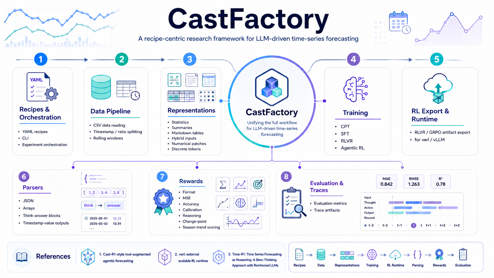

<h1 align="center">CastFactory</h1>

<p align="center">
  <strong>Towards a Large Language Model Training Framework for Time Series Forecasting</strong>
</p>

<p align="center">
  <a href="https://deepwiki.com/ustc-time-series/CastFactory"></a>
  <a href="https://github.com/ustc-time-series/CastFactory/stargazers"></a>
  <a href="https://github.com/ustc-time-series/CastFactory/network/members"></a>
  
  
  
</p>

<p align="center"></p>

<p align="center">
  <a href="#news">News</a> |
  <a href="#overview">Overview</a> |
  <a href="#architecture">Architecture</a> |
  <a href="#environment-setup">Setup</a> |
  <a href="#quick-start">Quick Start</a> |
  <a href="#example-recipes">Examples</a> |
  <a href="#acknowledgements">Acknowledgements</a>
</p>

## News

- **2026.05.27**: Added Cast-R1-style example integration and agentic time-series RLVR training support.
- **2026.05.15**: Added Time-R1-style staged CPT/SFT/RLVR examples, RLVR training support, and the core CPT and SFT training implementations.
- **2026.04.29**: Released CastFactory: *Towards a Large Language Model Training Framework for Time Series Forecasting*.

## Overview

CastFactory is a recipe-centric research framework for LLM-driven time-series forecasting. It
organizes data processing, time-series representation, model training, verifiable rewards,
evaluation, and trace artifacts around explicit YAML recipes, so CPT, SFT, and RLVR experiments can
be reproduced and extended with a consistent workflow.

The framework connects two lines of work: Time-R1-style staged training for forecasting LLMs and
Cast-R1-style tool-augmented sequential decision policies. For RLVR, CastFactory prepares
verl-compatible rollout datasets, reward entrypoints, config files, agent-loop configs, and launch
commands while keeping the external verl runtime outside this repository.

<p align="center">
  
</p>

### Capability Snapshot

| Area | Current support |
|---|---|
| Experiment control | YAML recipes, CLI runner, dotlist overrides, stage metadata |
| Data pipeline | CSV reader, timestamp/ratio split, rolling windows, leakage checks, train-only normalization utilities |
| Representations | Statistics, textual summaries, context prompts, Markdown tables, discrete tokens, numerical patches, hybrid prompts |
| Training stages | CPT, SFT, RLVR through `Experiment.fit()` |
| Local training backend | HuggingFace Transformers backends for CPT and SFT |
| RLVR export | verl 0.7.1-style GRPO/vLLM config, rollout JSONL, reward entrypoint, launch command |
| Agentic RLVR | Native verl AgentLoop config, Cast-R1-style tools, timestamp/value ground truth, univariate workflow |
| Evaluation | Standard, rolling, and zero-shot evaluators with point metrics |
| Traces | Automatic recipe/metrics/predictions/report/stage metadata; `RunStore` helpers for prompts, responses, parsed rows, and errors |

## Architecture

CastFactory is organized around one explicit contract: a recipe describes the full experiment, and
`Experiment` wires the selected components together.

```text
YAML recipe
  -> RecipeConfig validation and defaults
  -> CSV reader + timestamp/ratio split + rolling windows
  -> Representation adapter
  -> CPTDataset / SFTDataset / RLVRDataset
  -> Trainer + backend
  -> Evaluation, reward, and trace artifacts
```

For RLVR, the path branches by rollout workflow:

```text
single_turn
  -> text prompt rows
  -> rollout_dataset.jsonl
  -> verl_config.yaml
  -> castfactory.training.verl_reward_adapter:compute_score

time_series_agent
  -> raw chat rows
  -> agent_name: time_series_forecast_agent
  -> Cast-R1-style timestamp/value ground truth
  -> agent_loop_config.yaml
  -> native verl AgentLoop with time-series tools
```

## Highlights

- **Recipe-first experiments**: data, representation, model, training stage, reward, evaluation,
  rollout, and trace behavior are described in YAML recipes.
- **Three-stage training flow**: `cpt`, `sft`, and `rlvr` are first-class experiment stages in
  `Experiment.fit()`.
- **Leakage-aware data layer**: CSV reading, timestamp or ratio split, rolling windows, leakage
  checks, train-only normalization utilities, and visibility-separated `ForecastSample` objects.
- **Time-series representations**: textual statistics, context summaries, discrete tokens,
  numerical patches, hybrid prompts, and Markdown-table prompts.
- **Forecast parsers**: JSON, array, timestamp/value, and `<think>/<answer>` parsers with fallback
  behavior.
- **Verifiable rewards**: format, accuracy, calibration, reasoning, MSE, and agentic rewards for
  length, normalized MSE, change points, and season/trend structure.
- **verl integration**: RLVR recipes can export rollout datasets, verl config files, reward
  entrypoints, agent-loop config files, and launch commands for GRPO/vLLM training.
- **Trace artifacts**: `Experiment.evaluate()` writes recipe snapshots, metrics, predictions,
  leaderboards, and reports; `Experiment.fit()` writes stage metadata; `RunStore` also exposes
  helpers for prompts, responses, parsed rows, and errors.

## Repository Layout

```text
castfactory/
  cli/                 # command-line recipe runner
  core/                # RecipeConfig, Experiment, registries
  data/                # records, readers, splits, windows, leakage checks
  evaluation/          # point metrics and evaluation protocols
  models/              # backbone, bridge, head, and adapter skeletons
  parsers/             # forecast output parsers
  representation/      # time-series to LLM input representations
  rewards/             # verifiable reward functions
  trace/               # run artifact storage
  training/            # CPT/SFT/RLVR datasets, trainers, backends, agentic tools

examples/
  cpt/                 # ETTh1 CPT recipes
  sft/                 # ETTh1 SFT recipes
  rlvr/                # ETTh1 GRPO/RLVR recipes, Cast-R1-style agentic recipe, prompt template

scripts/               # server and 4-GPU launch helpers
tests/                 # unit tests by module area
```

## Environment Setup

Install CastFactory in editable mode:

```bash
python -m pip install -e .
```

Optional HuggingFace model loading:

```bash
python -m pip install -e ".[hf]"
```

Optional local CPT/SFT training stack:

```bash
python -m pip install -e ".[train]"
```

Optional time-series agentic RL helpers:

```bash
python -m pip install -e ".[agentic]"
```

Development tools:

```bash
python -m pip install -e ".[dev]"
```

### verl / vLLM Runtime

RLVR recipes generate artifacts for an external verl runtime. Before running exported GRPO/vLLM
launch commands, prepare a separate training environment with **verl 0.7.1** and its matching vLLM,
Ray, CUDA, and PyTorch stack.

CastFactory does not vendor verl. It writes the dataset, config, reward entrypoint, and launch
command that should be executed in that preconfigured verl 0.7.1 environment.

```bash
python -c "import verl; print(getattr(verl, '__version__', 'unknown'))"
```

Expected version:

```text
0.7.1
```

## Quick Start

Load a recipe:

```bash
python -m castfactory.cli.run examples/sft/etth1_qwen_sft.yaml
```

Run CPT or SFT locally with the configured Transformers backend:

```bash
python -m castfactory.cli.run examples/cpt/etth1_qwen_cpt.yaml --mode fit
python -m castfactory.cli.run examples/sft/etth1_qwen_sft.yaml --mode fit
```

Prepare RLVR artifacts for verl 0.7.1:

```bash
python -m castfactory.cli.run examples/rlvr/etth1_qwen_grpo.yaml --mode fit
```

Command-line dotlist overrides are supported:

```bash
python -m castfactory.cli.run examples/sft/etth1_qwen_sft.yaml --mode fit \
  model.backbone.model_name=Qwen/Qwen2.5-1.5B \
  training.args.num_train_epochs=1 \
  training.args.learning_rate=2.0e-4
```

## Example Recipes

| Stage | Recipe | Purpose | Output |
|---|---|---|---|
| CPT | `examples/cpt/etth1_qwen_cpt.yaml` | Convert ETTh1 windows into causal LM text streams | `./checkpoints/etth1_ot_qwen_cpt` |
| SFT | `examples/sft/etth1_qwen_sft.yaml` | Build single-turn forecasting instruction data from CPT checkpoint | `./checkpoints/etth1_ot_qwen_sft` |
| RLVR | `examples/rlvr/etth1_qwen_grpo.yaml` | Prepare single-turn GRPO artifacts for verl 0.7.1 | `./checkpoints/etth1_ot_qwen_grpo/rlvr/` |
| Agentic RLVR | `examples/rlvr/etth1_qwen3_1_7b_agentic_grpo_4gpu.yaml` | Prepare Cast-R1-style tool-augmented AgentLoop artifacts | `./checkpoints/etth1_qwen3_1_7b_4gpu/etth1_ot_qwen_agentic_grpo/rlvr/` |

The basic ETTh1 pipeline is checkpoint-chained:

```text
examples/cpt/etth1_qwen_cpt.yaml
  -> ./checkpoints/etth1_ot_qwen_cpt

examples/sft/etth1_qwen_sft.yaml
  -> init_checkpoint: ./checkpoints/etth1_ot_qwen_cpt
  -> ./checkpoints/etth1_ot_qwen_sft

examples/rlvr/etth1_qwen_grpo.yaml
  -> init_checkpoint: ./checkpoints/etth1_ot_qwen_sft
  -> ./checkpoints/etth1_ot_qwen_grpo
```

For larger Qwen3-1.7B 4-GPU examples, use:

```text
examples/cpt/etth1_qwen3_1_7b_cpt_4gpu.yaml
examples/sft/etth1_qwen3_1_7b_sft_4gpu.yaml
examples/rlvr/etth1_qwen3_1_7b_grpo_4gpu.yaml
examples/rlvr/etth1_qwen3_1_7b_agentic_grpo_4gpu.yaml
```

The helper scripts mirror these recipes:

```bash
bash scripts/cpt.sh
bash scripts/sft.sh
bash scripts/rlvr.sh
bash scripts/agentic_rlvr.sh
```

## CPT

CPT converts forecasting windows into causal language modeling text streams. The built-in
`CPTDataset` serializes observed time-series values with channel, domain, and unit metadata when
available. `TransformersCPTBackend` then tokenizes the text and trains a causal LM objective where
input tokens are also labels.

Minimal recipe shape:

```yaml
experiment:
  name: etth1_ot_qwen_cpt
  stage: cpt

data:
  reader:
    name: csv
    path: ./castfactory/dataset/ETTh1/ETTh1.csv
    timestamp_col: date
    target_channels: [OT]
  split:
    type: ratio
    ratios: [0.7, 0.1, 0.2]
  window:
    context_length: 96
    prediction_length: 96
    stride: 96

model:
  backbone:
    name: hf_causal_lm
    model_name: Qwen/Qwen2.5-1.5B

training:
  checkpoint_dir: ./checkpoints/etth1_ot_qwen_cpt
  backend:
    name: transformers
```

## SFT

SFT builds single-turn forecasting instruction examples. The dataset formats each row as an
instruction plus visible time-series context, and the output is a JSON forecast target. The
Transformers backend masks prompt tokens with `-100`, so loss is computed on response tokens.

Supported prompt inputs include representation text, future-known covariates, cutoff time,
prediction length, dataset metadata, target channel names, and template-defined placeholders.

The SFT backend exposes separate prompt and response token budgets:

```yaml
training:
  init_checkpoint: ./checkpoints/etth1_ot_qwen_cpt
  checkpoint_dir: ./checkpoints/etth1_ot_qwen_sft
  backend:
    name: transformers
    max_prompt_length: 2048
    max_response_length: 1024
```

## RLVR

RLVR supports both the default single-turn rollout workflow and a `time_series_agent` workflow that
uses verl native AgentLoop for multi-turn tool use. CastFactory builds rollout rows from forecasting
samples, exports them for verl 0.7.1, and connects model outputs back to task-specific reward
computation.

The current ETTh1 GRPO example uses:

- `MarkdownTableRepresentation` for historical context;
- an external instruction template file;
- `<think>...</think>` and `<answer>...</answer>` output structure;
- format checking before accuracy-style reward computation;
- MSE-based bounded reward;
- verl GRPO config generation with vLLM rollout settings.

Running an RLVR recipe prepares artifacts under the configured checkpoint directory:

```text
checkpoints/.../rlvr/
  rollout_dataset.jsonl
  verl_config.yaml
  agent_loop_config.yaml  # only for rollout.workflow.name: time_series_agent
  launch_command.txt
```

The generated reward entrypoint is:

```text
castfactory.training.verl_reward_adapter:compute_score
```

For Cast-R1-style agentic training, add a workflow section to an RLVR recipe:

```yaml
rollout:
  workflow:
    name: time_series_agent
    max_steps: 3
    max_parallel_calls: 5
    tool_parser_format: hermes
    model_service_url: http://localhost:8994
    prediction_models: [chronos2, arima, patchtst, itransformer]
    local_fallback: arima_then_last_value
```

This path is currently univariate. It writes raw chat prompts, `agent_name: time_series_forecast_agent`,
Cast-R1-style timestamp/value ground truth, and a native verl
`agent_loop_config.yaml`. The `predict_time_series` tool tries the configured HTTP model service
first and falls back locally to ARIMA, then last-value forecasting.

### Prompt, Parser, and Reward Design

The RLVR path strengthens the connection between model output format and verifiable reward
calculation.

Prompt construction is template-driven. A recipe can point to an external `.txt` instruction
template through `training.instruction_template_file`, keeping prompt design separate from Python
code. Templates can reference forecasting context variables such as:

- `prediction_length`
- `cutoff_time`
- `dataset_name`
- `attr_meaning`
- `target_channels`
- `covariate_channels`
- `data_lookback`

Structured parsing is handled by `ThinkAnswerForecastParser`. It expects the model to separate
reasoning and final prediction:

````text
<think>
...
</think>
<answer>
```
...
```
</answer>
````

`FormatReward` can validate both parse success and required structural blocks. If the response does
not satisfy the expected reasoning/answer format, the reward adapter can short-circuit the sample
and penalize invalid outputs before computing numerical rewards.

For prediction correctness, CastFactory currently includes accuracy-oriented rewards such as
`AccuracyReward`, `CalibrationReward`, and `MSEReward`. The Cast-R1-style agentic path also includes
length, normalized MSE, change-point, and season/trend reward components.

## Testing

Use the standard-library test runner:

```bash
python -m unittest discover -s tests -v
```

After installing development dependencies:

```bash
python -m pytest tests -q
python -m ruff check castfactory tests
```

## Current Scope

- `Experiment` currently supports CSV reader recipes and timestamp/ratio split recipes.
- The `time_series_agent` RLVR workflow currently supports univariate forecasting samples.
- RLVR `fit` prepares verl artifacts by default; execute them in a configured verl 0.7.1 runtime.
- The included ETTh1 examples are small, reproducible templates rather than benchmark claims.

## Acknowledgements

CastFactory is developed with thanks to the following open-source projects and research lines:

- [Time-R1](https://github.com/ustc-time-series/Time-R1), for the staged reasoning-oriented
  training direction for time-series forecasting LLMs.
- [Cast-R1](https://github.com/musihai/eeh1_test), for tool-augmented sequential decision policies
  for time-series forecasting.
- [verl](https://github.com/verl-project/verl), for the RL post-training runtime interfaces that
  CastFactory targets when exporting RLVR artifacts.

## License

No license file is included in this repository yet. Add a `LICENSE` file before public reuse,
redistribution, or packaging.
